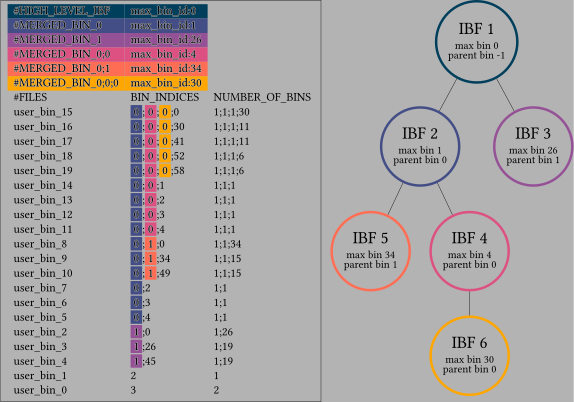

# Chopper - partition your sequences [![build status][1]][2] [![codecov][3]][4]

[1]: https://github.com/seqan/chopper/actions/workflows/ci_linux.yml/badge.svg?branch=main
[2]: https://github.com/seqan/chopper/actions?query=branch%3Amain
[3]: https://codecov.io/gh/seqan/chopper/branch/main/graph/badge.svg?token=SJVMYRUKW2
[4]: https://codecov.io/gh/seqan/chopper

## System requirements

* GCC Version >= 11
* CMake Version >= 3.18

## General setup

Set up the repository:

```
git clone --recurse-submodules https://github.com/seqan/chopper
```

Set up the build directory
```
mkdir chopper_build
cd chopper_build
cmake ../chopper
```

Build chopper
```
make
```

Optional: Build the test to check if everything works
```
make test
```
In case anything fails, please open a GitHub issue mentioning your OS and compiler version.


## Chopper

Chopper uses a hierarchical DP algorithm to layout user bins into a given number of technical bins,
optimizing the space consumption of a Hierarchical Interleaved Bloom Filter (HIBF).

Chopper needs an **input file** with filenames. The file could look like this:
(it is always good to give absolute instead of relative paths)

```
/path/to/file1.fa
/path/to/file2.fa
/path/to/file3.fa.gz
...
```

You can then **run chopper** with the following command:

```
./chopper --input data.tsv --kmer 21 --output chopper.layout
```

There are **more options** to tweak the layout (with sensible defaults). You get detailed information if you run:
```
./chopper --help
```

The resulting layout file can be used to build an HIBF index with
[raptor](https://github.com/seqan/raptor).

## Understanding the layout file

There is no need to actually understand the internals of the layout file, as you can just let
[raptor](https://github.com/seqan/raptor) build the HIBF index automatically from the layout.
If you are interested, or you have a specific use case, here is some information about the layout.
You will also find a [visualisation of the layout file](#visualisation-of-the-layout-file) at the end of this section.

**A layout file has 3 parts: (1) The config, (2) the header, (3) the layout content.**

At first, **the config** of chopper that created this particular file is stored.
The config part is identified by two hashes `##` at the beginning of each line. It starts with `##CONFIG` and ends with
`##ENDCONFIG`. It could look like this:

```
##CONFIG:
##{
##    "config": {
##        "version": 2,
##        "k": 19,

...

##ENDCONFIG
```

The config is followed by the actual **header** of the layout file, which stores important information for building the
HIBF index.
The header is identified by one hash `#` at the beginning of each line. It starts with `#HIGH_LEVEL_IBF max_bin_id:[X]`
and ends with `#FILES	BIN_INDICES	  NUMBER_OF_BINS`, the column names of the layout content.

It could look like this:

```
#HIGH_LEVEL_IBF max_bin_id:14
#MERGED_BIN_0 max_bin_id:0
#MERGED_BIN_5;3 max_bin_id:2

...

#FILES	BIN_INDICES	NUMBER_OF_BINS
```

Each line corresponds to one IBF in the hierarchy, identifying the maximum technical bin, maximal in its k-mer content.
This information is needed to compute the size of each IBF when building the HIBF.

Details:

1. `HIGH_LEVEL_IBF max_bin_id:[X]`: Reports the id (`[X]`) of that technical bin in the top/high-level IBF that has the
                                    highest k-mer content.
2. `MERGED_BIN_[Y] max_bin_id:[X]`: Reports the id (`[X]`) of that technical bin in the IBF identified by `[Y]`.


Following the header, the **layout content** describes the actual layout.
Each line reports the structure for a particular user bin. In that sense, the number of content lines is exactly the
same as that of the inputs.

It could look like this:

```
/path/to/file1.fa	12	3
/path/to/file2.fa	0;2	1;1
/path/to/file3.fa.gz	5;4	1;7

...
```

Columns of the layout content:

1. `FILES`: The file path(s) for the user bin.
2. `BIN_INDICES`: The technical bin indices on each level that the user bin is stored in. In the example:
                  * `file1.fa` is stored in technical bin `12` of the top-level IBF.
                  * `file2.fa` is stored in technical bin `0` of the top-level IBF which is a merged bin, so it's
                    also stored in a lower level IBF. In this lower level IBF, it is stored in technical bin `2`.
                  * `file3.fa.gz` is stored in technical bin `5` of the top-level IBF which is a merged bin, so it's
                    also stored in a lower level IBF. In this lower level IBF, it is stored in technical bin `4`.
3. `NUMBER_OF_BINS`: The number of technical bins the user bin is stored in on each level. For this example:
                  * `file1.fa` split into `3` technical bins (ids:`12,13,14`) on the top-level IBF.
                  * `file2.fa` is stored in a merged bin (`1`) and in a single bin (`1`) on the lower level.
                  * `file3.fa.gz` is stored in a merged bin (`1`) and is split into `7` bins (ids:`4,5,6,7,8,9,10`)
                     on the lower level.

### Visualisation of the layout file

<details><summary><b><i>Click here to show a visualisation of the layout file</i></b></summary>



</details>

## Multiple files per user bin

Currently, chopper always has a 1-to-1 relation between files and user bins when laying out.
If you want to assign multiple files to a user bin, you can use [raptor](https://github.com/seqan/raptor).

`raptor prepare` also handles files like this:

```
/path/to/file1-a.fa;/path/to/file1-b.fa;/path/to/file1-c.fa
/path/to/file2.fa
/path/to/file3.fa.gz

...
```

`copper` or alternatively `raptor layout` (which calls chopper) then computes the layout based on the precomputed files.
